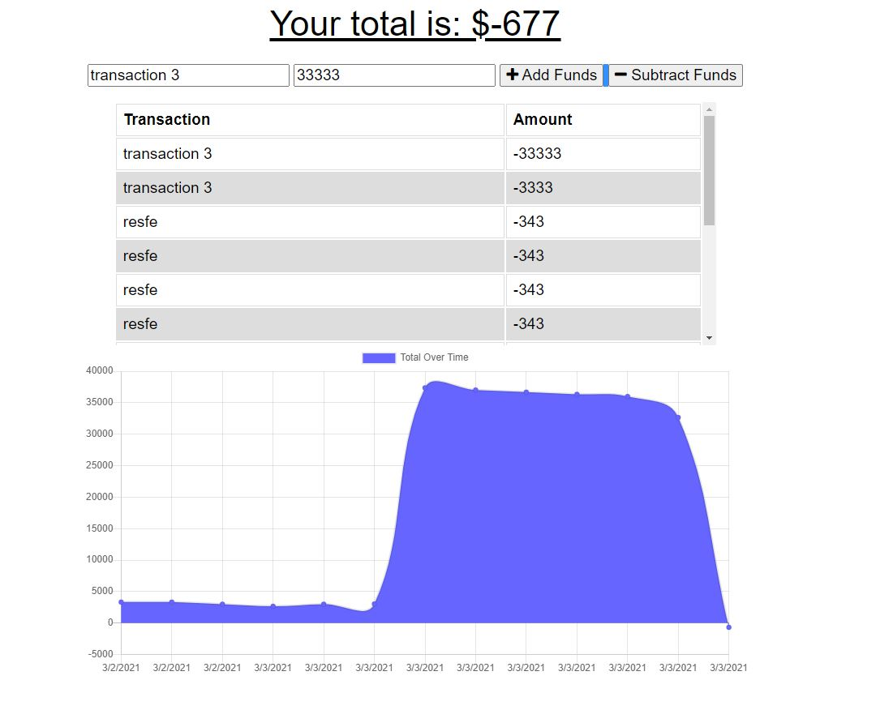

# BudgetTrackerPWA

## Table of Contents
[Description](#description)

[Installation](#installation)

[Usage](#usage)

[Credits](#credits)

## Description
This repository contains a progressive web application, that tracks transactions to an account online and offline. 

### Transaction page
    Displays data bout the last seven workouts.

## Installation
Downloading respository. In directory run npm install. This program requires a mongodb cluster. PLace the username and password of the cluster into a .env folder to connect. Then if desired use npm run seed to insert sample data into the database.

## Usage
The application is deployed to https://salty-sea-99414.herokuapp.com.
Server can be run in test usage with node server.js command.

## Credits
Made By Andrew Ehrman.

### Components Used
Node

npm packages

    "compression": "^1.7.4"

    "express": "^4.17.1"

    "lite-server": "^2.5.3"

    "mongoose": "^5.5.15"

    "morgan": "^1.9.1"

    "webpack-pwa-manifest": "^4.3.0"

    "webpack": "^5.24.2"

    "webpack-cli": "^4.5.0"